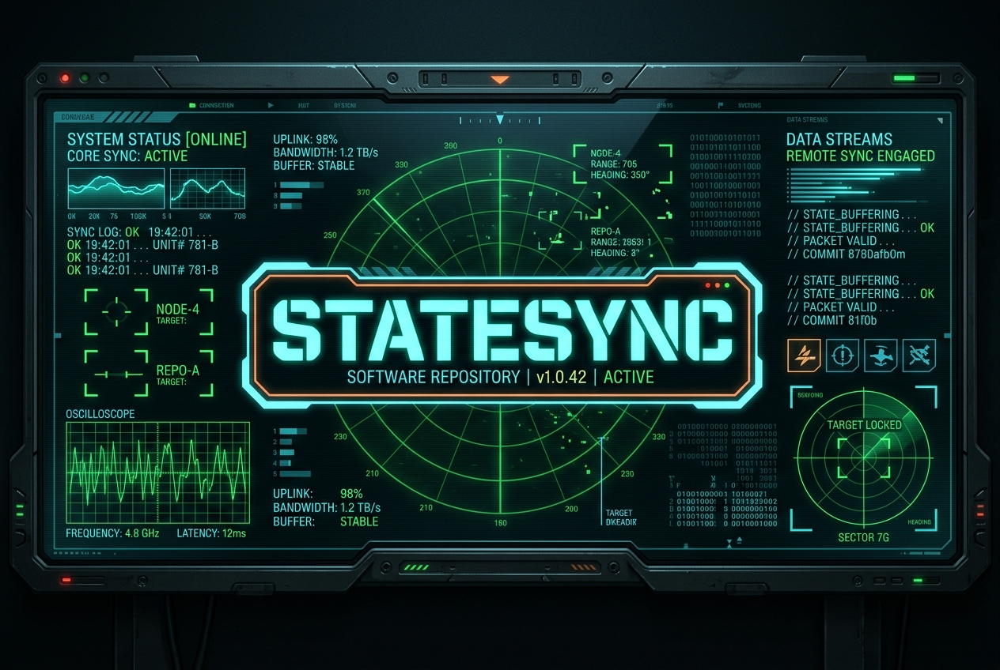

# statesync



A lightweight, high-performance Rust daemon designed to synchronize playback progress, watch states, and resume points bi-directionally between an arbitrary number of Emby and Jellyfin Media Servers in real-time.

It features a simple, beautiful **Web UI Dashboard** running on port `8754` so you can manage your servers directly from your web browser with zero configuration files to edit!

---

## Features

- **Web UI Dashboard**: Add, remove, and monitor your Emby and Jellyfin servers directly in your browser on port `8754`.
- **Bi-directional Real-Time Sync**: Syncs playback positions, play states, and paused/resumed statuses between all configured servers instantly.
- **Support for N-Servers**: Syncs across 2, 3, or more servers seamlessly.
- **IMDb & TMDb Matching**: Uses global identifiers (IMDb ID and TMDb ID) from the metadata of your media files to link items. Works perfectly even if database IDs, filenames, or library structures differ between your servers.
- **LDAP-Friendly User Mapping**: Matches users across servers automatically by matching their usernames (case-insensitive). Perfect for setups synced via LDAP or Active Directory.
- **Intelligent Feedback Loop Prevention**: Caches and tracks the last synchronized positions per user/movie to prevent endless "ping-pong" update loops between servers.
- **Robust Connection Recovery**: Connects to the WebSockets of all servers concurrently and automatically reconnects in case of connection dropouts or server restarts.
- **Zero Server Modification**: Requires no plugins, DLLs, or restarts on your servers. Connects purely via standard REST APIs and WebSockets.

---

## Container Deployment (Docker / Unraid)

We package `statesync` as a lightweight container using **RedHat UBI-minimal (`ubi9/ubi-minimal`)** as the secure base runtime image.

### 1. Run with Docker Compose (Recommended)

1. Create a `docker-compose.yml` file:
   ```yaml
   version: '3.8'
   services:
     statesync:
       build: .
       container_name: statesync
       restart: unless-stopped
       ports:
         - "8754:8754"
       volumes:
         - ./config:/config
       environment:
         - RUST_LOG=info
   ```
2. Build and start the container:
   ```bash
   docker compose up -d --build
   ```

### 2. Run with Docker CLI
```bash
docker run -d \
  --name statesync \
  -p 8754:8754 \
  -v /path/to/config:/config \
  -e RUST_LOG=info \
  statesync:latest
```

Once the container starts, open **`http://<your-ip>:8754`** in your browser to add your servers and configure settings!

---

## Technical Details

- **Web Port**: `8754` (configurable inside container).
- **Persistent Data**: The service automatically saves your configurations to `/config/config.json`.
- **Dynamic Reloader**: When you add or delete a server in the Web UI, the synchronization loops are gracefully stopped, caches are rebuilt, and the sync tasks are restarted dynamically in the background without needing to restart the container!

---

## Local Development (Without Containers)

1. Install Cargo and Rust.
2. Build and run locally:
   ```bash
   RUST_LOG=info cargo run
   ```
   Open `http://localhost:8754` to access the dashboard.
