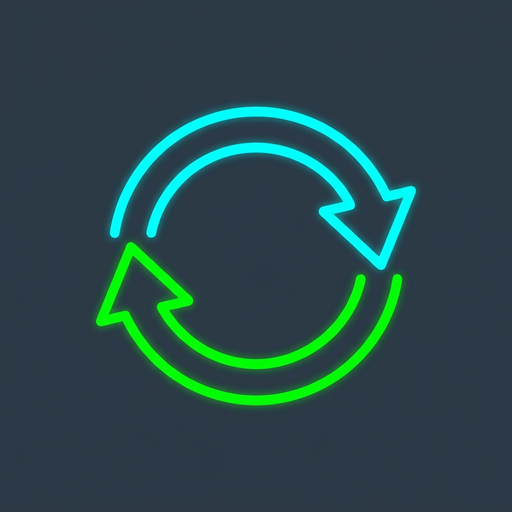

<p align="center">
  <a href="https://github.com/studio2201/statesync">
    
  </a>
</p>

#  StateSync

Watched, resume, and favorites synced across Emby and Jellyfin.

## Install

```bash
docker run -d --name statesync -p 4601:4601 -v statesync-config:/config ghcr.io/studio2201/statesync:latest
```

No environment variables required. Open [http://localhost:4601](http://localhost:4601).

## One perfect example

1. Run the install command above.
2. Dashboard: Add server, paste Emby or Jellyfin URL and API key, Save. Type is auto-detected. Browser paths such as `/web/index.html` are reduced to host and port.
3. Add the other server the same way.
4. If usernames differ, use Link users.
5. Play something on one server and watch state appear on the other. Optional: Preview force, then Force sync for history. Per user: Force, Clear watched, or Ignore.

## Deploy targets

| Target | How |
|--------|-----|
| Docker | One-liner above (`ghcr.io/studio2201/statesync`) |
| Unraid | Import `unraid/unraid-template.xml`; appdata `/mnt/user/appdata/statesync`; port 4601; shell `sh` (BusyBox ash). If Emby or Jellyfin use br0, put StateSync on br0 as well. |
| Compose | `container/docker-compose.yml` (port and volume only) |
| Binary | GitHub Release `statesync-linux-x86_64-*.tar.gz` (static musl) |

Image tags: `latest`, `0.28.x`, `v0.28.x`.

## What it syncs

| | Live | Force |
|--|------|--------|
| Played | yes | yes (skip if already equal) |
| Position | yes | yes |
| Favorites | yes | yes |

Clear watched is a dedicated per-user action on every server, not force. Not synced: ratings, playlists, libraries, media files.

## Runtime defaults

| | Default |
|--|---------|
| Bind | `0.0.0.0:4601` |
| Config | `/config/config.json` |
| Auth | off |
| Base image | Alpine Linux with BusyBox ash |
| User | PUID 99, PGID 100 when unset |

Optional environment variables and architecture notes: [docs/ARCHITECTURE.md](docs/ARCHITECTURE.md). Brand assets: [graphics/BRAND.md](graphics/BRAND.md).

```bash
statesync --validate
statesync --sync-force --dry-run
statesync --sync-force
statesync --tui
```

## Links

- Issues: https://github.com/studio2201/statesync/issues
- Packages: https://github.com/studio2201/statesync/pkgs/container/statesync
- Releases: https://github.com/studio2201/statesync/releases

## License

Apache License 2.0. See [LICENSE](LICENSE).
